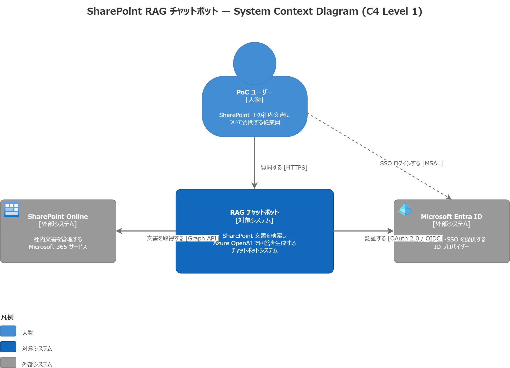
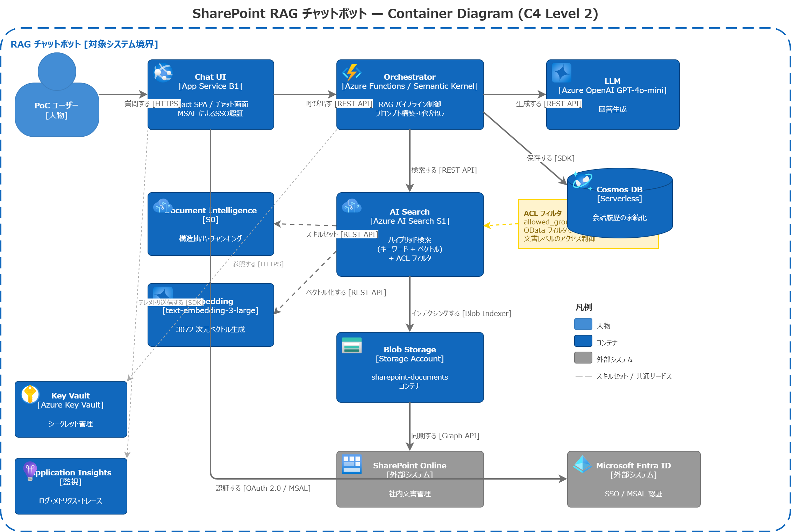

# SharePoint RAG Azure

[](https://azure.microsoft.com/)
[](LICENSE)
[](infra/)

SharePoint 文書を対象とした、**ACL ベースのアクセス制御付き RAG チャットボット**。

Azure AI Search + Azure OpenAI を基盤とし、**SharePoint のフォルダ単位の権限を検索時に反映**する RAG システム。ユーザーは自身がアクセス権を持つ文書のみを情報源とした回答を取得できる。

## 特徴

- **ACL 連動検索** — SharePoint フォルダ権限を `allowed_groups` フィルタでインデックスに同期
- **Graph API インジェスト** — Microsoft Graph API 経由で文書取得（SP インデクサー非使用）。メタデータ + ACL を完全抽出
- **ハイブリッド検索** — ベクトル (text-embedding-3-large) + キーワード + セマンティックリランカー
- **会話メモリ** — Cosmos DB によるマルチターン会話履歴
- **エンタープライズ設計書** — 要件定義から試験仕様書までのフルライフサイクルドキュメント

## アーキテクチャ

### システムコンテキスト図 (C4 Level 1)


### コンテナ図 (C4 Level 2)


### デプロイメント図


| コンポーネント | サービス | SKU |
|-------------|---------|-----|
| LLM | Azure OpenAI | GPT-4o-mini |
| Embedding | Azure OpenAI | text-embedding-3-large (3072 dim) |
| 検索 | Azure AI Search | Standard S1 |
| ストレージ | Blob Storage | StorageV2 LRS |
| データベース | Cosmos DB | Serverless |
| 認証 | Entra ID | SSO (MSAL) |
| ホスティング | App Service | B1 |
| IaC | Bicep | — |

## リポジトリ構成

```
sharepoint-rag-azure/
├── docs/                    # 設計書（ライフサイクル順）
│   ├── 01-requirements.md       # 要件定義書
│   ├── 02-architecture.md       # アーキテクチャ設計書（ADR 含む）
│   ├── 03-security.md           # セキュリティ設計書（STRIDE 脅威モデル）
│   ├── 04-resource-design.md    # リソース設計書 + コスト試算
│   ├── 05-parameter-sheet.md    # パラメータシート（値は REDACT 済み）
│   ├── 10-build-guide.md        # 構築手順書（ステップバイステップ）
│   └── 11-test-spec.md          # 試験仕様書（ACL シナリオ）
├── diagrams/                # 構成図（draw.io）
├── infra/                   # Infrastructure as Code
│   ├── modules/                 # リソース別 Bicep モジュール
│   └── parameters/              # 環境別パラメータ
└── .github/workflows/       # CI/CD（予定）
```

## 設計書一覧

| # | 文書 | 内容 | 版数 |
|---|------|------|------|
| 01 | [要件定義書](docs/01-requirements.md) | スコープ、ユースケース、機能/非機能要件 | v0.6 |
| 02 | [アーキテクチャ設計書](docs/02-architecture.md) | コンポーネント設計、データフロー、ADR | v0.7 |
| 03 | [セキュリティ設計書](docs/03-security.md) | STRIDE 脅威モデル、認証/認可、ACL 設計 | v0.4 |
| 04 | [リソース設計書](docs/04-resource-design.md) | 命名規則、SKU 選定、コスト試算、RBAC | v0.6 |
| 05 | [パラメータシート](docs/05-parameter-sheet.md) | 全リソースの設定値（機密値は REDACT 済み） | v0.3 |
| 10 | [構築手順書](docs/10-build-guide.md) | Azure Portal / CLI によるステップバイステップ構築 | v0.5 |
| 11 | [試験仕様書](docs/11-test-spec.md) | ACL シナリオテスト（12 ケース × 3 ユーザー = 36 テストポイント） | v0.1 |

## ACL テストマトリクス

本プロジェクトの核心 — **権限漏洩ゼロ**:

| | 01_経営 | 02_人事労務 | 03_営業 |
|---|---|---|---|
| **ユーザーA**（全権限） | ○ | ○ | ○ |
| **ユーザーB**（部分権限） | × | ○ | ○ |
| **ユーザーC**（最小権限） | × | ○ | × |

> ○ = 文書が返る、× = ACL フィルタでブロック

テストシナリオ: 基本 ACL、クロスフォルダ、サブフォルダ深層、プロンプトインジェクション耐性、メタデータ漏洩防止、ハルシネーション検知。

## はじめに

### 前提条件

- Azure サブスクリプション（共同作成者権限）
- Entra ID アプリ登録（Graph API 権限: `Sites.Read.All`, `Files.Read.All`）
- SharePoint テストサイト
- Azure CLI / Azure PowerShell

### デプロイ手順

> 詳細な手順: [構築手順書](docs/10-build-guide.md)

1. Azure リソース作成（Resource Group、OpenAI、Storage、Cosmos DB、Key Vault、AI Search、App Service）
2. RBAC 設定（10 件のロール割り当て）
3. Key Vault シークレット登録（9 件）
4. SharePoint フォルダ権限の ACL テスト用設定
5. インジェストパイプライン実行（Graph API → Blob → AI Search インデックス）
6. ACL テスト実施（[試験仕様書](docs/11-test-spec.md) に準拠）

### デプロイ

```bash
# Functions デプロイ
cd functions
zip -r ../functions.zip .
az functionapp deployment source config-zip \
  -g rg-sprag-poc-jpe -n func-sprag-poc-jpe \
  --src functions.zip

# webapp デプロイ
cd webapp
npm install && npm run build
zip -r ../webapp.zip .
az webapp deployment source config-zip \
  -g rg-sprag-poc-jpe -n app-sprag-poc-jpe \
  --src webapp.zip
```

webapp 環境変数:

| 変数名 | 値 |
|--------|-----|
| `BACKEND_API_URL` | Functions エンドポイント URL |
| `FUNCTIONS_KEY` | Functions デフォルトキー |

Entra ID 認証: App Service →「認証」→ ID プロバイダー「Microsoft」→ `app-sprag-poc` を選択。Entra ID アプリ側でリダイレクト URI と ID トークンを有効化する。

### 使い方

1. `https://app-sprag-poc-jpe.azurewebsites.net` にアクセス
2. Entra ID でサインイン（シングルテナント、自社アカウントのみ）
3. チャット UI で質問を入力 — SharePoint 文書を情報源とした回答が返る
4. ユーザーのフォルダ権限に応じて、アクセス権のある文書のみが検索対象となる

### リソースホスト名

| リソース | ホスト名 |
|---------|---------|
| Functions | `func-sprag-poc-jpe-xxxxxxxxxx.japaneast-01.azurewebsites.net` |
| App Service | `app-sprag-poc-jpe.azurewebsites.net` |
| AI Search | `srch-sprag-poc-jpe.search.windows.net` |
| Azure OpenAI | `oai-sprag-poc-eastus2.services.ai.azure.com` |

> Functions は新しい Azure 命名形式 `{name}-{hash}.{region}-01.azurewebsites.net` が適用される。

## 運用手順

### 文書の追加・更新

```bash
# 1. SP → Blob 同期
cd scripts && python sp_to_blob.py

# 2. AI Search インデクサー実行（API or ポータル）
curl -X POST "${SEARCH_ENDPOINT}/indexers/sprag-indexer/run?api-version=2024-07-01" \
  -H "api-key: ${SEARCH_API_KEY}"

# 3. ACL メタデータ更新（必須）
python update_index_metadata.py
```

> **重要**: インデクサー再実行後は必ず `update_index_metadata.py` を実行すること。スキルセットの制約により `allowed_groups` は自動的にはインデックスに反映されない。

### 既知の制限事項

| 制限 | 影響 | 改善策 |
|------|------|--------|
| Functions Consumption プランのコールドスタート | 初回リクエストが 10-30秒かかる場合がある | webapp 側でリトライ実装済み。Premium プランで解消可能 |
| Excel/PDF のチャンク品質 | 構造データ（フリガナ等）がノイズとして混入 | Document Intelligence の活用（リソースは構築済み） |
| GPT-4o-mini の回答品質 | 要約・統合の精度に限界 | GPT-4o への切替（コスト ~10倍、PoC 規模では月 ~$10） |
| ACL はメールアドレスベース | セキュリティグループ非対応 | Graph API でグループメンバーシップ取得に拡張可能 |
| 02_人事労務 は `*` ワイルドカード | 継承権限のフォルダは全員アクセス可として扱う | SP 権限 API の応答仕様による制約 |

## コスト試算（PoC）

| リソース | 月額概算 |
|---------|---------|
| AI Search S1 | ~$245 |
| App Service B1 | ~$13 |
| Azure OpenAI | ~$2（従量課金） |
| Cosmos DB Serverless | ~$1 |
| その他 | ~$5 |
| **合計** | **~$266/月** |

## ライセンス

[MIT](LICENSE)
